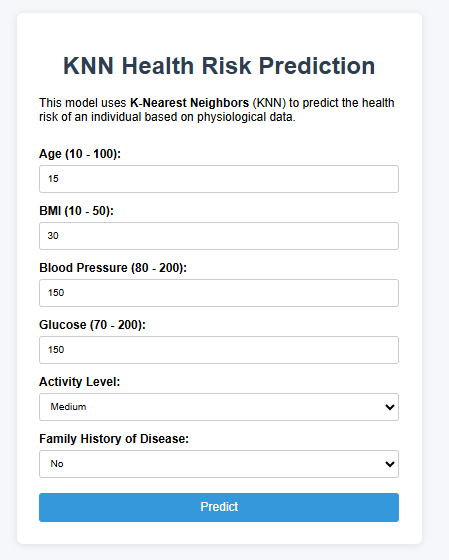
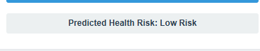

# KNN-Based Health Risk Predictor

A web-based Health Risk Prediction System built using the **K-Nearest Neighbors (KNN)** algorithm and deployed with **Flask**. This project predicts potential health risks based on user-entered medical metrics such as age, BMI, blood pressure, glucose level, and cholesterol.

---

##  Features

-  Predict health risks using KNN
-  Accepts essential health metrics as input
-  Clean and simple web interface
-  Fast predictions with a pre-trained ML model
-  Easy to customize or extend with new models

---

##  Machine Learning Model

- **Algorithm**: K-Nearest Neighbors (KNN)
- **Library**: scikit-learn
- **Distance Metric**: Euclidean

**Input Features:**
- Age
- BMI (Body Mass Index)
- Blood Pressure
- Glucose Level
- Cholesterol Level

---

##  Project Structure

```
knn-health-predictor/
│
├── app.py                   # Flask web application
├── model/
│   ├── train_model.py       # Script to train and save the KNN model
│   └── scaler.pkl           # Serialized scaler for input preprocessing
│
├── dataset/
│   └── knn_health_risk_dataset.csv  # Dataset used to train the model
│
├── templates/
│   └── index.html           # HTML page for UI (form and results)
│
└── README.md                # Project documentation
```

---

##  Installation & Setup

### 1. Clone the Repository

```bash
git clone https://github.com/nithinskumar866/KNN_model.git
cd knn-health-predictor
```

### 2. Install Dependencies

Ensure Python 3.8+ is installed.

```bash
pip install -r requirements.txt
```

### 3. Train the Model

```bash
python model/train_model.py
```

This will generate the model and scaler file needed for predictions.

### 4. Run the Web Application

```bash
python app.py
```

Visit: [http://127.0.0.1:5000/](http://127.0.0.1:5000/) in your browser.

---

##  Sample Dataset

Example from `knn_health_risk_dataset.csv`:

```csv
age,bmi,blood_pressure,glucose,cholesterol,risk
45,25.4,120,88,180,low
58,30.1,140,150,220,high
36,27.8,130,95,200,medium
...
```

---

##  Screenshots
Input page:


Output:



---

##  Future Enhancements

- Add user authentication
- Track and visualize user health trends
- Export prediction reports (PDF/CSV)
- Add more features like exercise levels, hereditary conditions, etc.
- Mobile responsive interface

---

